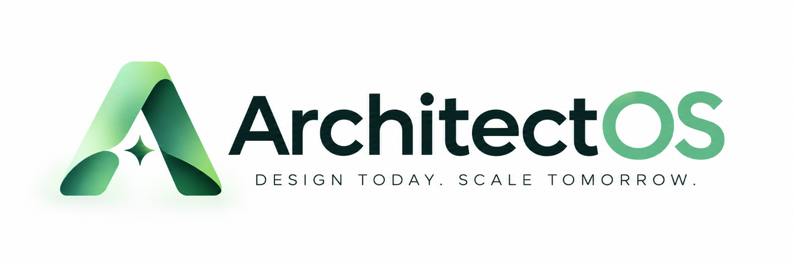

# ArchitectOS web

The ArchitectOS frontend, implemented from `docs/frontend/design-system.md`.

Stack: Next.js 16 (App Router), React 19, TypeScript (strict), Tailwind CSS 4, React Flow, TanStack Query, Zustand, Zod, Vitest + Testing Library, Playwright + axe, Storybook.

## Run

```bash
npm install
npm run dev              # http://localhost:3000, uses the mock backend (.env.development)
```

| Script                                  | Purpose                                                                          |
| --------------------------------------- | -------------------------------------------------------------------------------- |
| `npm run typecheck`                     | `next typegen` + `tsc --noEmit`                                                  |
| `npm run lint` / `npm run format:check` | ESLint / Prettier                                                                |
| `npm test`                              | Unit + component tests (Vitest)                                                  |
| `npm run test:e2e`                      | Golden path, axe checks and visual regression (Playwright; builds with mocks on) |
| `npm run storybook`                     | Design-system reference                                                          |

Refresh visual baselines only for intentional UI changes: `npx playwright test tests/e2e/visual.spec.ts --update-snapshots`.

E2E suites in `tests/e2e/`: `golden-path` (spec §79), `surfaces` (every route × light/dark × desktop/phone,
axe), `visual` (§81 baselines: dashboard, workspace, inspector, validation, capacity, simulation, reliability,
cost, evolution, dark mode), `keyboard` (§80: landmarks, skip link, focus traps, canvas shortcuts) and
`performance` (§116, budgets below).

## Performance budgets

Measured by `tests/e2e/performance.spec.ts` on the generated large project (`proj_large`, ~120 components in
9 domains), production build with mocks, Chromium at 1440×900 on a CI-class machine (4 vCPU):

| Metric                                                                                             | Budget     |
| -------------------------------------------------------------------------------------------------- | ---------- |
| Time to interactive canvas, Overview and Detailed (navigation start → nodes rendered, fit settled) | < 2 500 ms |
| Frame time while panning the canvas (`requestAnimationFrame` deltas during a drag), p95            | < 50 ms    |

Measured values are attached to each test as annotations. On slower hardware set `PERF_BUDGET_SCALE`
(e.g. `1.5`) rather than editing the budgets; never loosen a budget to make a regression pass.

## Backend integration

`apps/api` has no implementation yet, so there is no real contract to consume. The frontend defines a
**proposed** contract instead, and every place that depends on it is marked `INTEGRATION POINT`:

- `schemas/*.ts` — Zod schemas for every response (all responses are validated at the boundary).
- `api/*.ts` — one module per resource, with the endpoint list in its header.
- `api/client.ts` — base URL, request IDs, timeouts, retries, error normalisation, and
  `setAccessTokenProvider()` for auth (auth scheme not decided yet).

Until the API exists, `NEXT_PUBLIC_API_MOCKS=true` serves responses from `api/mock/` (in-browser
fixtures; a "Mock data" badge is shown on every screen). Mock numbers are fixtures, not engine output.
Switch it off in `.env.development` once `apps/api` serves `/api/v1`.

## Layout

```
app/          routes (thin; render feature containers)
  (marketing)/  public pages: /, /product, /architecture, /simulation, /pricing, /docs
  (app)/        the application: entered at /app (redirects to /dashboard); /dashboard, /projects,
                /project/[projectId]/… — the group adds no URL segment and marks its pages noindex
components/   ui/ primitives, layout/, navigation/, command/ (⌘K), feedback/ (empty/error/loading)
features/     architecture/ (workspace), requirements/, capacity/, validation/, health/,
              evidence/, decisions/, reports/, projects/
api/ hooks/   data layer (server state via TanStack Query)
stores/       client state (Zustand): architecture draft + undo/redo, workspace, UI, command bar
schemas/ types/ lib/ config/ providers/ styles/ (tokens.css = design tokens)
```

Marketing and application routes are separate route groups (spec §117): the application lives in
`app/(app)/` and is entered at `/app`.
